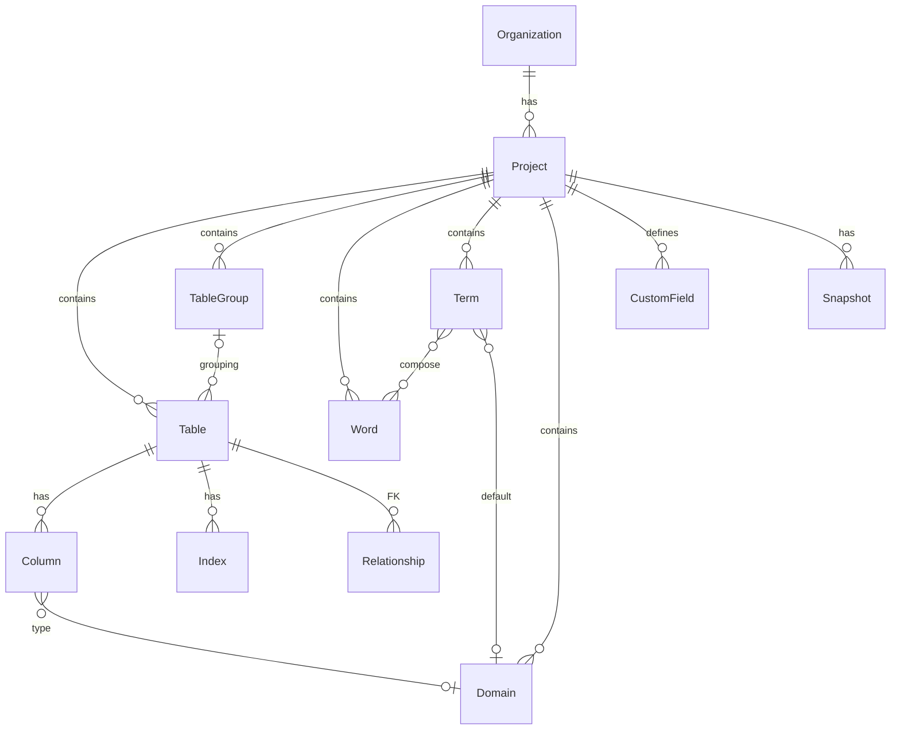

# 개념 도메인 모델

모든 기능 문서가 참조하는 허브 문서. 엔티티 이름과 용어는 이 문서를 기준으로 통일한다.

## 계층 구조

```
서비스 전역 (ERDD 제공)
└─ 공용 리소스: 표준 단어사전(행안부 등), 표준 용어사전, 표준 도메인 세트
     │  (복사/fork + 이후 재동기화)
     ▼
조직 (Organization) ── 과금·멤버 관리 단위 (개인/팀 — 가입 시 개인 조직 자동 생성)
├─ 조직 공용 리소스: 조직 표준 단어/용어/도메인 사전, 커스텀 항목 템플릿
│    │  (복사/fork + 재동기화)
│    ▼
└─ 프로젝트 (Project) ── ERD 작업 단위, 하나의 DB 스키마 모델
   ├─ 스키마 모델: Table / Column / Relationship / Index / Note
   ├─ TableGroup — 그룹핑과 그룹별 배치
   ├─ 프로젝트 사전: Word(단어) / Term(용어) / Domain(도메인)
   ├─ CustomField — 커스텀 항목 정의
   └─ 버전: Revision(자동 이력) + Snapshot(시점 스냅샷)
```

- **프로젝트 = 하나의 DB 스키마 모델**이다. 복수 스키마·복수 다이어그램은 현재 범위가 아니다(로드맵의 "추후 검토" 참조). 업무 영역 분리는 TableGroup으로 해결한다.
- 실제 ERD가 참조하는 사전·도메인·커스텀 항목은 항상 **프로젝트 범위**의 것이다. 전역/조직 리소스는 프로젝트로 복사해서 쓰는 원본 저장소 역할이다.

## 공용 리소스 패턴: 복사(fork) + 재동기화

단어/용어/도메인 사전과 커스텀 항목 템플릿에 공통 적용되는 규칙.

1. **가져오기(fork)** — 전역 또는 조직 리소스를 프로젝트로 복사한다. 각 항목에 원본 참조(원본 ID + 가져온 시점의 원본 버전)를 기록한다.
2. **자유 수정** — 프로젝트에서 항목을 추가·수정·삭제해도 원본에 영향이 없다. 프로젝트 독립성이 항상 보장된다.
3. **재동기화** — 원본이 갱신되면 프로젝트에서 수동으로 재동기화를 실행한다.
   - 원본의 신규 항목 → 추가 제안
   - 원본 변경 + 프로젝트 미수정 항목 → 자동 갱신 제안
   - 원본 변경 + 프로젝트 수정 항목 → **충돌 목록**으로 표시, 항목별로 "원본 반영 / 프로젝트 유지" 선택
   - 프로젝트에서 자체 추가한 항목 → 그대로 유지
4. 반대 방향(프로젝트 → 조직 리소스로 승격)은 조직 관리자 승인으로 가능하다.

## 엔티티 카탈로그

### 계정·조직

| 엔티티 | 설명 | 주요 속성 |
|---|---|---|
| User | 서비스 계정 | 이메일, 이름, 인증 정보, 서비스 역할(admin/user), 활성 여부 |
| Organization | 과금·멤버 관리 단위 | 이름, 종류(개인/팀), 플랜 |
| Member | 조직 소속 | User 참조, 조직 역할(Owner/Admin/Member) |
| Project | ERD 작업 단위 | 이름, 설명, 명명 규칙 설정, 대상 DB 방언(복수) |
| ProjectMember | 프로젝트 참여 | Member 참조, 프로젝트 역할(Admin/Editor/Viewer) |
| ApiToken | CLI 인증용 토큰 | 프로젝트 범위, 권한(read/write), 만료 |

### 스키마 모델

| 엔티티 | 설명 | 주요 속성 |
|---|---|---|
| Table | 테이블 | 논리명, 물리명, 설명, 소속 TableGroup, 커스텀 항목 값, 배치 좌표(전체 뷰) |
| Column | 컬럼 | 논리명, 물리명, Domain 참조 **또는** 직접 타입(논리 타입 문법), PK 여부, 자동증가, NOT NULL, 기본값, 순서, 설명, 커스텀 항목 값 |
| Relationship | 관계(FK) | 부모/자식 테이블, 참조 컬럼 매핑, 1:1 / 1:N, 식별/비식별, 관계명 |
| Index | 인덱스 | 대상 테이블, 구성 컬럼(순서·정렬), 유니크 여부, 이름 |
| Note | 캔버스 메모 | 내용, 배치 좌표, 색상 |
| TableGroup | 테이블 그룹 | 이름, 색상, 설명, 소속 테이블 목록, 그룹 뷰 배치 좌표(테이블별) |

- 물리명 유일성: 테이블 물리명은 프로젝트 내 유일, 컬럼 물리명은 테이블 내 유일.
- 테이블 배치 좌표는 **전체 뷰용 1벌 + 소속 그룹 뷰용 1벌**을 각각 저장한다(→ [12-grouping](12-grouping.md)).

### 명명 체계 (행안부 3단 체계 호환)

| 엔티티 | 설명 | 주요 속성 |
|---|---|---|
| Word(단어) | 명명의 최소 단위 | 논리명(한글), 물리 약어(영문), 영문명, 설명, 동의어, 원본 참조 |
| Term(용어) | 단어의 조합 | 논리명(예: 회원번호), 구성 Word 목록(순서), 조합 물리명(예: MBR_NO), 기본 Domain 연결, 설명, 원본 참조 |
| Domain(도메인) | 컬럼 타입의 표준 정의 | 이름, 분류, 논리 데이터 타입, DB 방언별 물리 타입 매핑(PostgreSQL/MySQL/Oracle/MSSQL), 기본값, 허용값, 원본 참조 |

- 컬럼 논리명 입력 → Term 매칭 → 물리명·도메인 자동 제안. 없으면 Word 분해 조합으로 생성(→ [13-naming](13-naming.md)).
- 검증은 **경고 수준**이다. 미등록 단어/용어가 있어도 저장은 허용하고, 경고 배지와 사전 등록 유도로 해결한다.

### 커스텀 항목

| 엔티티 | 설명 | 주요 속성 |
|---|---|---|
| CustomField | 프로젝트별 추가 속성 정의 | 이름, 적용 대상(테이블/컬럼), 타입(텍스트/불리언/선택형), 선택지, 필수 여부, 기본값, 순서 |

예: 암호화여부, 개인정보여부, 비고. 값은 Table/Column의 "커스텀 항목 값"에 저장된다(→ [15-custom-fields](15-custom-fields.md)).

### 버전

| 엔티티 | 설명 | 주요 속성 |
|---|---|---|
| Revision | 자동 변경 이력 | 순번, 작업자, 시각, 작업 유형, 대상 객체, 변경 내용(before/after) |
| Snapshot | 시점 스냅샷 | 이름(예: "v1.0 오픈"), 설명, 기준 Revision, 생성자, 시각 |

- 모든 편집은 Revision으로 기록된다. Snapshot은 특정 Revision 시점에 이름을 붙인 것이다.
- 스냅샷 간(또는 스냅샷↔현재) diff와 복원을 제공한다(→ [11-collaboration](11-collaboration.md)).
- CLI 동기화의 충돌 판정 기준점으로도 Revision을 사용한다(→ [16-cli](16-cli.md)).

## 엔티티 관계 요약



## 권한 모델

2단 구조: 조직 역할 × 프로젝트 역할.

| 역할 | 범위 | 권한 |
|---|---|---|
| Org Owner/Admin | 조직 | 멤버·과금·조직 공용 리소스 관리, 전체 프로젝트 접근 |
| Org Member | 조직 | 초대된 프로젝트만 접근 |
| Project Admin | 프로젝트 | 프로젝트 설정, 멤버, API 토큰, 스냅샷 관리 |
| Project Editor | 프로젝트 | 스키마·사전 편집, 스냅샷 생성 |
| Project Viewer | 프로젝트 | 조회, 내보내기 |
